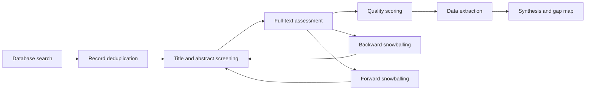

<div class="cover-kicker">Systematic literature review protocol proposal</div>

# Human-Robot Interaction in Computer Science

## Computer science methods, platforms, and evaluation patterns in modern HRI

---
layout: default
class: agenda-slide
---

# Review Frame

<div class="thesis-card">
  <strong>Thesis</strong>
  <p>This review will clarify how computer science methods shape HRI systems across robotic platforms, autonomy architectures, evaluation practices, and emerging foundation-model workflows.</p>
</div>

<div class="agenda-grid">
  <div>
    <span>01</span>
    <strong>Scope</strong>
    <p>Define HRI as a computational and embodied interaction problem.</p>
  </div>
  <div>
    <span>02</span>
    <strong>Protocol</strong>
    <p>Set PICOC, search sources, criteria, and scoring rules.</p>
  </div>
  <div>
    <span>03</span>
    <strong>Extraction</strong>
    <p>Map platforms, methods, domains, evaluation, and autonomy roles.</p>
  </div>
  <div>
    <span>04</span>
    <strong>Outcomes</strong>
    <p>Deliver a coding schema, taxonomy, and evidence gap map.</p>
  </div>
</div>

---
class: emphasis-slide
---

## Motivation & Scope

<div class="lead">
Human-Robot Interaction (HRI) studies how humans and embodied robots perceive, communicate, coordinate, and act together. This protocol focuses on the <strong>computer science perspective</strong>: algorithms, architectures, and evaluation methods behind those interactions.
</div>

<div class="scope-grid">
  <div>
    <strong>Timespan</strong>
    <p>The 2020–2026 period marks a transition from traditional pipeline-based autonomous systems and classical AI/ML methods toward LLM/VLM-driven<sup>1</sup> systems for planning, perception, dialogue, and adaptation.</p>
  </div>
  <div>
    <strong>Concrete example</strong>
    <p>A service robot that uses speech, vision-language grounding, task planning, and safety checks to help a human complete a shared task.</p>
  </div>
  <div>
    <strong>Out of scope</strong>
    <p>Purely psychological, sociological, design-only, or non-embodied AI studies without a clear HRI/robotic system component.</p>
  </div>
</div>

<p>
<sup>1</sup> LLM: Large Language Model; VLM: Vision-Language Model;
</p>

---
class: robot-learning-slide
---

## Robot learning approaches

<div class="duality-band">
  <div>
    <span>Traditionally</span>
    <strong>Task-specific learning loops</strong>
  </div>
  <carbon-arrow-right />
  <div>
    <span>Shifting towards</span>
    <strong>Foundation-model mediated adaptation</strong>
  </div>
</div>

<div class="learning-duality">
  <div>
    <div class="learning-title"><carbon-user-speaker />Teaching, imitation, teleoperation</div>
    <p>Robots learn from demonstrations or direct human control, but require labeled behavior data, specialized interfaces, and user training.</p>
  </div>
  <div>
    <div class="learning-title"><carbon-machine-learning-model />Reinforcement learning</div>
    <p>Policies can exceed demonstrations, yet complex reward design, exploration, convergence, and instability remain major bottlenecks.</p>
  </div>
  <div class="learning-current">
    <div class="learning-title"><carbon-ibm-watson-discovery />LLM/VLM foundation models</div>
    <p>Large multi-domain priors support zero-shot reasoning, task understanding, and multimodal grounding across text, speech, and vision.</p>
  </div>
</div>

<div class="transition-claim">
  The shift is from <strong>programming or training each behavior</strong> toward <strong>using broad priors to interpret goals, plan, and adapt</strong> in changing HRI environments.
</div>

--- 

## PICOC

<div class="picoc-cards">
  <div class="picoc-card">
    <div class="picoc-title"><carbon-user-multiple />Population</div>
    <p><strong>Studies of physical robotic systems</strong> (humanoids, cobots, mobile/service robots) and human-robot interaction<i>. Simulation-only work</i> is included only when it targets embodied robotic interaction.</p>
  </div>

  <div class="picoc-card">
    <div class="picoc-title"><carbon-machine-learning-model />Intervention</div>
    <p><strong>AI-based computational methods for robot decision-making in HRI</strong>, including classical ML, deep learning, reinforcement learning, and foundation models (LLMs, VLMs), applied to <u>planning, control and policy generation</u>.</p>
  </div>

  <div class="picoc-card">
    <div class="picoc-title"><carbon-compare />Comparison</div>
    <p>Traditional rule-base, model-based approaches or non-generative methods.</p>
  </div>

  <div class="picoc-card">
    <div class="picoc-title"><carbon-chart-evaluation />Outcome</div>
    <p>Evaluation criteria across <u>interaction quality, and human-centered outcomes</u> (i.e., trust, workload, safety, predictability, and legibility).</p>
  </div>

  <div class="picoc-card picoc-card-wide">
    <div class="picoc-title"><carbon-earth />Context</div>
    <p>Categorises study settings (industrial, service, healthcare, hazardous environments) and evaluation modalities (lab, field, simulation) to assess validity and generalizability of HRI findings.</p>
  </div>
</div>

---
class: rq-slide
---

## Research Questions

<div class="rq-groups">
  <span>Platforms & domains</span>
  <span>Methods & evaluation</span>
  <span>Limitations & gaps</span>
</div>

<div class="rq-cards">
  <div class="rq-card"><span>01</span><p>Which physical robotic systems and HRI taxonomies are most frequently studied in primary HRI research?</p></div>
  <div class="rq-card"><span>02</span><p>Which AI-based computational approaches are used at the levels of planning, control and policy generation?</p></div>
  <div class="rq-card"><span>03</span><p>How do AI-driven HRI approaches compare with rule-based, model-based and non-generative approaches on evaluation metrics?</p></div>
  <div class="rq-card"><span>04</span><p>What is the Autonomy/HITL structure of the robotic systems, (e.g. human as operator, advisor, teacher, supervisor, collaborator or beneficiary) and what is the interaction paradigm that is used?</p></div>
  <div class="rq-card"><span>05</span><p>What evaluation metrics and assessment frameworks are used in HRI studies?</p></div>
  <div class="rq-card"><span>06</span><p>What are the recurring limitations, ethical concerns, and open research gaps in HRI studies?</p></div>
</div>

---
layout: two-cols-header
class: criteria-slide
---


## Inclusion / Exclusion criteria

::left::

### Include

**Studies that are:**
- Primary HRI / robotics / CS empirical studies
- Full-text, English, **2020-2026**
- Defined method + empirical results
- Peer-reviewed archival papers
- Preprints only if no reviewed version exists

::right::

### Exclude

**Studies that are:**
- Non-primary (editorials, position papers, templates, surveys)
- Not full-text or not in English
- Books, chapters, or monographs
- Duplicate reports (keep most complete/latest)
- Non-embodied AI without robotic interaction

::bottom::

<div class="criteria-bottom">

<strong>Peer-reviewed scope:</strong>

The following venues are where the majority of influential robotics and HRI research is published. They are highly selective and use expert reviewers from the robotics community.

* **Primary HRI venues**: ACM/IEEE HRI, RO-MAN
* **General robotics venues**: ICRA, IROS
* **Robot learning and embodied AI venues**: CoRL, RSS
* **High impact robotics journals**: RA-L, T-RO, IJRR, Science Robotics

<p></p>


<p> <strong>Additional rule:</strong> backward/forward snowballing may add relevant primary studies (possibly from other venues); surveys and taxonomies are used only as mapping sources.</p>

</div>

---

## Quality assessment

<div class="rubric-note">
  Score each criterion as <strong>0</strong> absent, <strong>1</strong> partial, or <strong>2</strong> adequate. Low-scoring studies remain visible in the map but are flagged for sensitivity analysis rather than automatically removed.
</div>

<div class="quality-grid">
  <div class="quality-card">
    <div class="quality-title"><carbon-search />Research clarity</div>
    <p>The study should state clear research questions, hypotheses, or objectives.</p>
  </div>
  <div class="quality-card">
    <div class="quality-title"><carbon-data-structured />Method detail</div>
    <p>The paper must sufficiently describe its research design, such as experimental setup, dataset, and task conditions.</p>
  </div>
  <div class="quality-card quality-card-wide">
    <div class="quality-title"><carbon-chart-error-bar />Evaluation fit</div>
    <p>The evaluation should be appropriate for the stated objectives, including suitable baselines or ablation/benchmarking procedures where relevant.</p>
  </div>
  <div class="quality-card">
    <div class="quality-title"><carbon-deployment-pattern />Deployment context</div>
    <p>The study should report relevant details about datasets, simulation environments, or real-world deployment conditions.</p>
  </div>
  <div class="quality-card">
    <div class="quality-title"><carbon-checkmark-outline />Evidence alignment</div>
    <p>Results should be interpreted in a way that is consistent with the presented evidence.</p>
  </div>
  <div class="quality-card">
    <div class="quality-title"><carbon-code />Artifacts</div>
    <p>When applicable the study should provide artifacts such as code, parameter settings, datasets, and prompts.</p>
  </div>
  <div class="quality-card">
    <div class="quality-title"><carbon-warning-alt />Validity threats</div>
    <p>The study should acknowledge limitations, biases, or internal/external validity threats.</p>
  </div>
</div>

---
class: search-slide
---

## Sources extraction and databases

```txt
(HRI OR "human-robot interaction" OR "human-robot collaboration") AND
(robot* OR humanoid* OR cobot* OR "service robot*" OR "mobile robot*") AND

(
  "machine learning" OR "deep learning" OR
  "reinforcement learning" OR
  "foundation model*" OR LLM* OR VLM* OR
  "generative AI"
) AND

(planning OR control OR "decision making" OR "policy generation")
```

The query derives from the Population and Intervention components of PICOC. Each term has been expanded with common synonyms and wildcards to capture variations in terminology.
Other PICOC components are excluded to avoid missing those studies that do not explicitly state them in their title or abstract.

**Database sources**: Scopus, IEEE Xplore, ACM Digital Library.

<div class="search-result-note">
  <strong>Early search check:</strong> Scopus 2,068, IEEE Xplore 2,053, ACM Digital Library 2,371. Due to the large number of results, further refinement of the search strategy may be necessary.
</div>

---
class: pipeline-slide
---

## Review pipeline



---
class: extraction-slide
---

## Data extraction

**Extraction dimensions:**

<ol class="dimension-grid">
  <li><strong>AI / ML & Foundation-Model Stack:</strong> classical ML/DL, RL/IL for control, LLM/VLM, hybrid architectures.</li>
  <li><strong>Robotic Platforms:</strong> humanoid/anthropomorphic, manipulators/cobots, mobile/ground robots</li>
  <li><strong>Robotic Focus Area:</strong> task/motion planning, manipulation, physical interaction</li>
  <li><strong>Evaluation Setting:</strong> simulation-only, real robot without participants, lab study, field deployment.</li>
  <li><strong>Interaction Paradigm:</strong> teleoperation/direct control, shared autonomy, dialogue, grounded instruction.</li>
  <li><strong>Autonomy / HITL Structure:</strong> human as operator, advisor, teacher, supervisor, collaborator, or beneficiary.</li>
</ol>

---
class: extraction-table-slide
---

## Draft extraction table

| Extraction dimension | Example / extraction fields |
|---|---|
| AI / ML & Foundation-Model Stack | classical ML/DL; RL/IL for control; LLM, VLM; hybrid architectures; model names, training/fine-tuning, prompting details |
| Robotic Platforms | humanoid/anthropomorphic; manipulator/cobot; mobile/ground robot |
| Robotic Focus Area | task/motion planning; manipulation; physical interaction; navigation |
| Evaluation Setting | simulation-only; real robot without participants; lab study; field deployment |
| Interaction Paradigm | teleoperation/direct control; shared autonomy; dialogue; grounded instruction |
| Autonomy / HITL Structure | human as operator, advisor, teacher, supervisor, collaborator, beneficiary |
| Metrics | success rate, task completion, latency, recovery, safety incidents |
| Evidence quality & artifacts | baseline, ablation, participant data, code, datasets, prompts, videos, supplementary materials |

---
class: synthesis-slide
---

## Planned synthesis

<div class="synthesis-grid">
  <div><carbon-chart-column /> <strong>Frequency mapping</strong><p>Count platforms, domains, methods, evaluation settings, and outcome metrics.</p></div>
  <div><carbon-map /> <strong>Evidence map</strong><p>Cross-tabulate method families against robotic focus areas and deployment maturity.</p></div>
  <div><carbon-text-link-analysis /> <strong>Narrative synthesis</strong><p>Explain recurring design patterns, trade-offs, and limitations across study clusters.</p></div>
  <div><carbon-warning-square /> <strong>Gap example</strong><p>LLM-based planners may be common in demos but under-evaluated in long-running real-world HRI deployments.</p></div>
</div>

---
layout: center
class: outcomes-slide
---

## Expected outcomes

<ul class="outcome-row">
  <li>
    <div class="outcome-icon"><carbon-document-requirements /></div>
    <strong>Protocol</strong>
    <p>Reproducible review protocol plus a screening and quality-scoring rubric.</p>
  </li>
  <li>
    <div class="outcome-icon"><carbon-tree-view-alt /></div>
    <strong>Coding schema</strong>
    <p>Extraction spreadsheet and controlled vocabulary for platforms, methods, metrics, and contexts.</p>
  </li>
  <li>
    <div class="outcome-icon"><carbon-idea /></div>
    <strong>Gap analysis</strong>
    <p>Evidence map identifying underexplored method-domain pairs and weak deployment evidence.</p>
  </li>
</ul>

---
class: validity-slide
---

## Threats to validity & bias control

<ul class="risk-grid">
  <li><span>01</span><strong>Construct coverage</strong><p>Risk: PICOC may oversimplify HRI metrics. Mitigation: code system, interaction, and human-centered outcomes separately.</p></li>
  <li><span>02</span><strong>Selection bias</strong><p>Risk: databases may miss niche venues. Mitigation: use backward and forward snowballing from included studies.</p></li>
  <li><span>03</span><strong>Terminology drift</strong><p>Risk: LLM/VLM/foundation-model terms change quickly. Mitigation: record aliases and update search strings during refinement.</p></li>
  <li><span>04</span><strong>Publication bias</strong><p>Risk: positive and fashionable results dominate. Mitigation: track baselines, failures, limitations, and deployment maturity.</p></li>
  <li><span>05</span><strong>External validity</strong><p>Risk: papers may overrepresent lab settings. Mitigation: separate simulation, lab, real-robot, and field evidence.</p></li>
  <li><span>06</span><strong>Fast-moving field</strong><p>Risk: AI literature may become outdated during review. Mitigation: freeze search date and report late-breaking studies separately.</p></li>
</ul>

---
layout: center
class: conclusion-slide
---

## Conclusion

<div class="conclusion-panel">
  <strong>Core takeaway</strong>
  <p>This protocol frames HRI as an embodied computer science problem: methods, platforms, autonomy structures, and evaluation practices must be mapped together to understand the field.</p>
</div>

<div class="conclusion-grid">
  <div><carbon-document /> <span>Protocol</span><p>Refine query strings, screening rules, and quality scoring.</p></div>
  <div><carbon-table /> <span>Evidence base</span><p>Extract platforms, methods, metrics, contexts, and deployment maturity.</p></div>
  <div><carbon-map /> <span>Synthesis</span><p>Produce a taxonomy and gap map for future related-work writing.</p></div>
</div>

